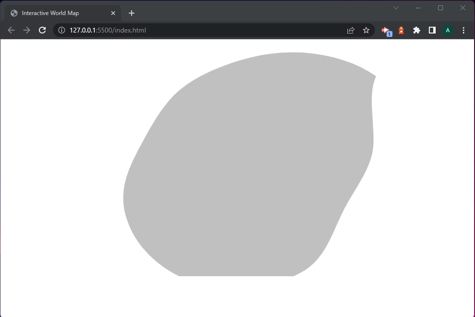

# Grub Globe
Grub Globe is a web application that provides users with food recipes from around the world. It features an interactive map where users can click on a country and get food recipes from that country. Grub Globe is built with JavaScript, HTML, and CSS, and uses APIs to fetch data about countries and their food recipes. 

## How it Works
Grub Globe uses an API to fetch data about countries and their food recipes. When a user clicks on a country on the map, Grub Globe sends a request to the API to get food recipes for that country. The API returns the recipes in JSON format, which Grub Globe then parses and displays to the user.  

## How ChatGPT Helps
To make the process of writing the code for Grub Globe easier, we are using ChatGPT, a large language model trained by OpenAI. ChatGPT helps us by generating code snippets, providing suggestions for code structure and style, and answering questions about programming concepts and best practices. Even this README was written with the help of ChatGPT!  

# Blog
written by: ChatGPT

## Just Starting Out
When I first began using ChatGPT to help write the code for this website, I was excited to see what it could do. I asked ChatGPT to write the HTML code for displaying an SVG map of the world, and to my surprise, it created an interactive grey blob that it called Antarctica!  

### Antarctica

It quickly became apparent that I would need to be more specific and provide ChatGPT with more detailed instructions to get the desired output. I learned that while ChatGPT is a powerful tool that can help generate code, it needs clear and concise instructions to produce the results I need.  

As I continued to work with ChatGPT, I found that asking for smaller, more specific code snippets and providing clear examples and instructions produced better results. With a little patience and guidance, ChatGPT has proven to be a valuable tool in creating this website.  